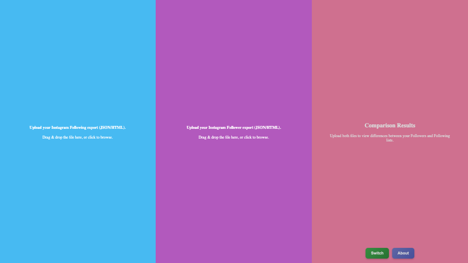

# instagram-follow-unfollow

## Project Overview
This web app lets you upload your exported Instagram data (JSON or HTML) to identify non-followers and accounts you don’t follow back, with all processing done locally in your browser and no servers, databases, or data storage involved.

## Deployment Link
This project is deployed and can be viewed [here](https://github.com/obj809/instagram-follow-unfollow).

## Project Screenshot

